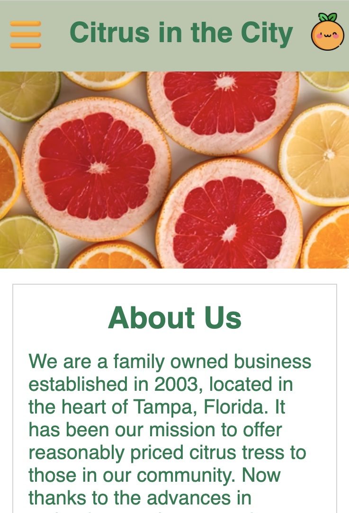
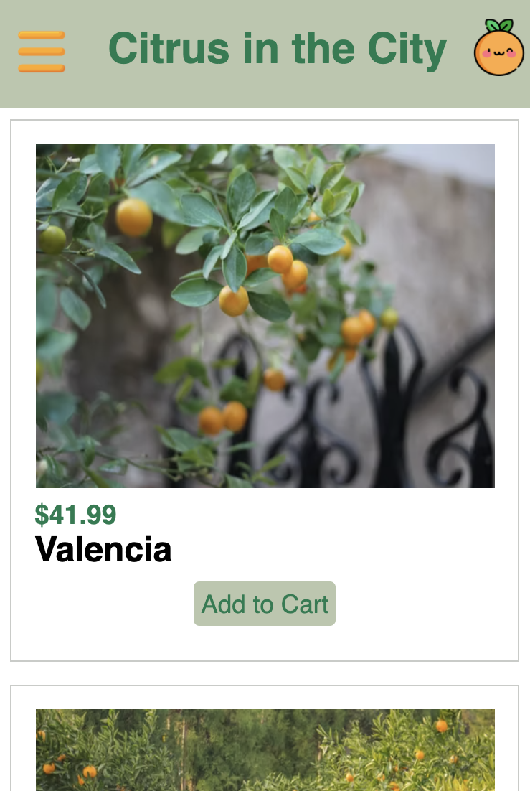
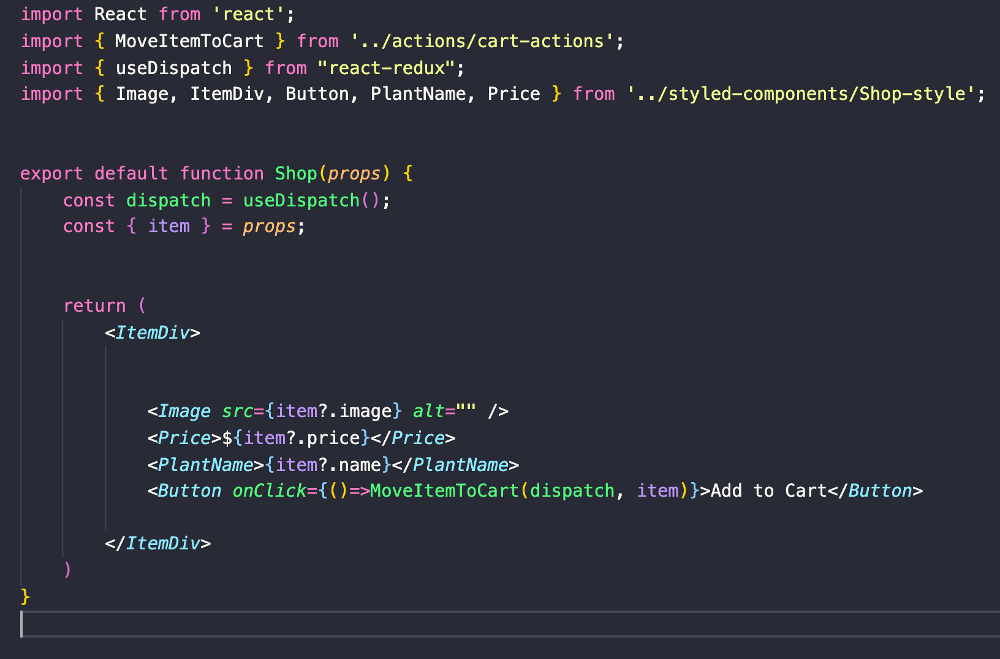
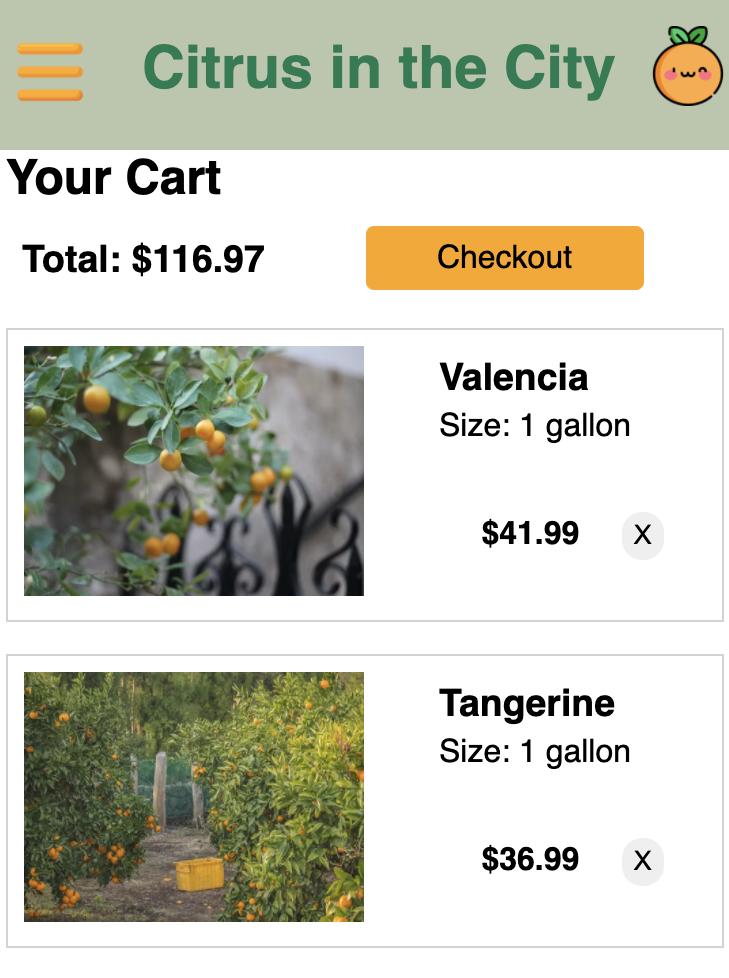
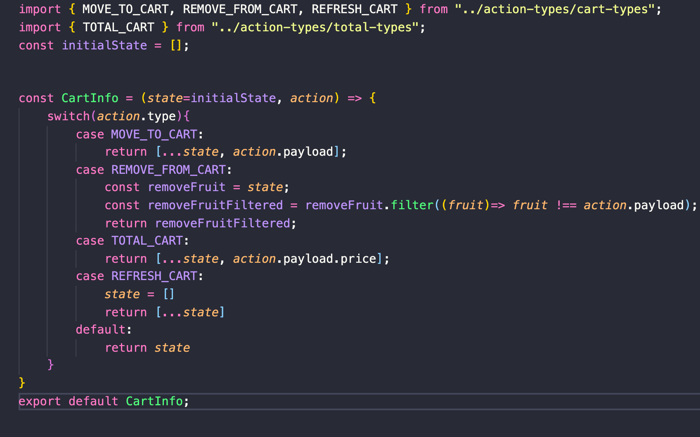
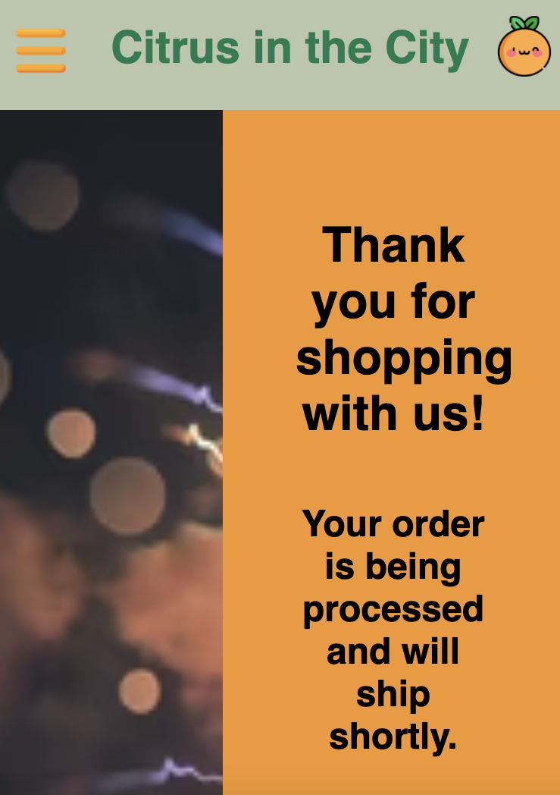

# Citrus in the City

I had the inspiration to create this e-commerce citrus tree website from my family. The citrus industry was a big part of my childhood and is a big part of my family. My grandparents have been running their own citrus nursery since long before I was even born. I grew up learning how to water the trees, cut budwood, etc. Recently, my Dad branched out and started his very own citrus nursery, and I could not be more proud of how successful it has become. It takes hard work and dedication to grow the quality trees my family does. 

## Technologies Used

For this porject I used React, Redux, and styled components. In order to get my react app running with all the things I needed I had to run "npm i react-redux redux styled-components redux-logger" in my terminal. 

Medium Article: https://medium.com/@kdmatthews77/citrus-in-the-city-a-website-to-fulfill-your-citrus-needs-6f5568c6e723

## Layout

### Home Page

I tried to keep the home page simple and user friendly. I wrote some background information about the company as well as a contact page where users can type questions or concerns. When you click on the hamburger menu, the users will be able to select the home, shop, or cart pages.

### Shop Page

On this page users will be able to browse the citrus trees and prices for the company. They can add trees to their cart. To get this page running I first created a shop reducer and actions. The reducer contains the initial state. The initial state is an array of objects. Each object contains the name, price, quantity (I did not get around to finishing the quantity portion of this project, but hope to return to it later), size, and image. This is mapped over in the shop container component in order to get this information to render on the page. 

 
    

### Cart Page

The cart page is the most involved page. There is a cart reducer with an initial state of a blank array. The cart-actions made were MoveItemToCart and RemoveItemFromCart. The MoveItemToCart action was placed on a button in the shop page. When this button gets pressed, the action gets dispatched and it adds that item to the state in the cart reducer. The RemoveItemFromCart action was added to a button in the cart page. This button was styled to look like an "X". When a user presses this button the action is dispatched, it matches the case in the reducer, and the item is removed from state. This page also consists of a total. 

The total is a seperate container with a function that adds the total of the items in the cart. The last thing I added to this page was the checkout button. When a user clicks the checkout button, they will be taken to the last page.

### Thank You Page

This page simply thanks the user for their purchase and provides them with a link to UPS. This page was added as something to make the page even more user friendly. 

...

I really enjoyed working on this project. It was definitely the most elaborate project I have built so far, but overall I am really porud of the outcome. It was great to get this experience with React/Redux. They are a little less intimidating to use now, and I hope to continue advancing my skill in them both. 

